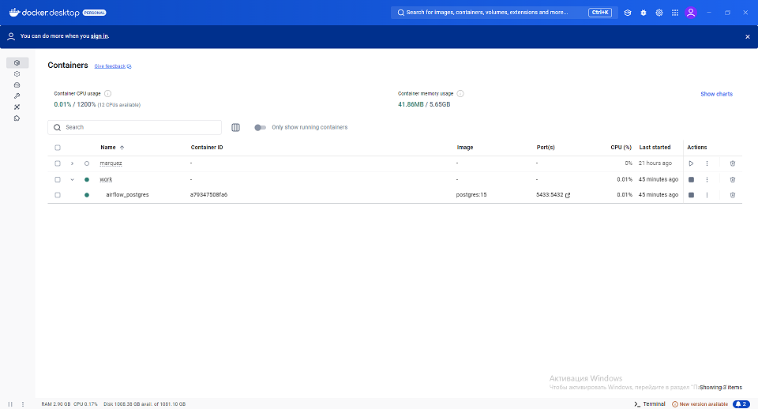

# Краткий гайд: Настройка Airflow (в WSL), PostgreSQL (в Docker) и подключение через DBeaver

Этот гайд описывает процесс настройки локальной среды для работы с Apache Airflow и PostgreSQL, где Airflow запущен в WSL ([как это сделать](https://github.com/MaratNotes/marat_notes/tree/master/how_data_works-practice_cases/airflow_wsl)), а PostgreSQL - в Docker на хост-машине (Windows).

## 1. Установка Docker Desktop

1.  Перейди на официальный сайт [Docker Desktop](https://www.docker.com/products/docker-desktop/).
2.  Скачай установщик для Windows.
3.  Запусти установщик и следуй инструкциям. Docker Desktop установит и Docker Engine, и Docker Compose.
4.  Запусти Docker Desktop после установки. Он должен отображаться в системном трее и выглядеть примерно так:
    


## 2. Создание и запуск контейнера PostgreSQL

1.  Создай директорию для проекта, например, `airflow-postgres-project`.
2.  В этой директории создай файл `docker-compose.yml` со следующим содержимым:

    ```yaml
	version: '3.8'

	services:
	  postgres:
	    image: postgres:15
	    container_name: airflow_postgres_example
	    environment:
	      POSTGRES_USER: example_user
	      POSTGRES_PASSWORD: example_pass
	      POSTGRES_DB: example_db
	    ports:
	      - "5532:5432"  # Пробрасываем порт 5432 контейнера на 5532 хоста
	    volumes:
	      - postgres_data_volume:/var/lib/postgresql/data # Для сохранения данных

	volumes:
	  postgres_data_volume: # Объявляем именованный том
    ```

3.  Открой терминал (Git Bash, cmd, PowerShell или терминал WSL).
4.  Перейди в директорию с `postgres_db.yml`.
5.  Выполни команду для запуска контейнера в фоновом режиме:

    ```bash
    docker-compose -f postgres_db.yml --project-name postgres_db up -d
    ```

6.  Проверь, что контейнер запущен:

    ```bash
    docker ps
    ```

    Ты должен увидеть контейнер `airflow_postgres_example` в списке.

## 3. Подключение через DBeaver (с локального компьютера)

1.  Скачай и установи DBeaver с официального сайта: [https://dbeaver.io/](https://dbeaver.io/).
2.  Открой DBeaver.
3.  Создай новое подключение к PostgreSQL:
    *   **Host**: `localhost` или `127.0.0.1` (так как DBeaver и Docker работают на одной машине)
    *   **Port**: `5532`
    *   **Database**: `example_db`
    *   **Username**: `example_user`
    *   **Password**: `example_pass`
4.  Протестируй подключение. Если успешно - сохрани его.

## 4. Настройка подключения в Airflow

1.  Убедись, что Airflow запущен в WSL (`airflow webserver` и `airflow scheduler`).
2.  **Определи IP-адрес Windows хоста:**
    *   Открой командную строку Windows (`cmd`) и выполни команду `ipconfig`.
    *   Найди строку `IPv4-адрес` в разделе основного сетевого адаптера (Ethernet или Wi-Fi). Запиши этот адрес (например, `192.168.0.107`).
3.  **Проверь доступность порта из WSL с помощью telnet:**
    *   Открой терминал WSL.
    *   Установи telnet client (если он не установлен):
        ```bash
        sudo apt update && sudo apt install telnet -y
        ```
    *   Выполни команду для проверки доступности порта:
        ```bash
        telnet <IPv4-адрес_из_ipconfig> 5532
        ```
        Например:
        ```bash
        telnet 192.168.0.107 5532
        ```
    *   Если соединение установлено (появляется пустой экран или спецсимволы), значит порт доступен. Нажми `Ctrl + ]`, затем `quit` чтобы выйти из telnet.
    *   Если соединение отклонено (например, `telnet: Unable to connect to remote host: Connection refused`), проверь, запущен ли контейнер и правильно ли проброшен порт.
4. Открой веб-интерфейс Airflow (по умолчанию `http://localhost:8080`).
5. Отредактируй файл airflow.cfg в Wsl. У меня он находиться в папке `/home/local_admin/airflow`.
   Я поставил alias
   ```
   alias npp="\"/mnt/c/Program Files/Notepad++/Notepad++.exe\""
   ```
   и после этого
   ```
   npp airflow.cfg
   ```
   Найди строку `test_connection = Disabled`. Измени значение на `Enabled`, это необходимо для активации кнопки тестирования подключения в Airflow.
   Перезагрузи `airflow webserver` и `airflow scheduler` в отдельных терминалах.
6.  Перейди в меню `Admin` -> `Connections`.
7.  Найди подключение `postgres_default` или создай новое:
    *   **Connection Id**: `postgres_default`
    *   **Connection Type**: `Postgres`
    *   **Host**: `<IPv4-адрес_из_ipconfig>` (например, `192.168.0.107`)
    *   **Schema**: `example_db`
    *   **Login**: `example_user`
    *   **Password**: `example_pass`
    *   **Port**: `5532`
8.  Сохрани настройки.

## 5. Создание DAG для работы с PostgreSQL

1.  В директории `dags` твоего Airflow окружения создай папку `sql`.
2.  В папке `sql` создай файлы SQL-скриптов (`create_client_table.sql`, `insert_clients.sql`).
3.  В папке `dags` создай файл DAG'а `finance_postgres_dag.py`, используя `PostgresOperator` для выполнения SQL-скриптов из папки `sql`.

    Содержимое этих файлов приведено в репозитории.
	
	Пример структуры DAG можно посмотреть в [официальном гайде PostgresOperator](https://airflow.apache.org/docs/apache-airflow-providers-postgres/2.2.0/operators/postgres_operator_howto_guide.html).

## 6. Проверка работы

1.  Необходимо установить дополнительный модуль находясь в WSL в окружении Airflow (помните, на [первом занятии](https://github.com/MaratNotes/marat_notes/tree/master/how_data_works-practice_cases/airflow_wsl) - 
`source ENV/bin/activate`)
```
pip install apache-airflow-providers-postgres
```
Перезагрузи `airflow webserver` и `airflow scheduler` в отдельных терминалах.
2.Запусти созданный DAG в веб-интерфейсе Airflow.
3.  Проверь логи выполнения задач.
4.  Открой подключение в DBeaver и проверь, что таблицы и данные были созданы.

Теперь у тебя есть полностью настроенная среда для работы с Airflow и PostgreSQL.